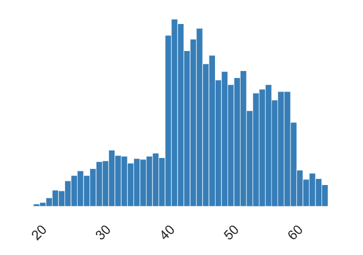
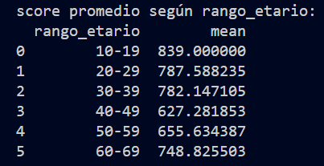

# Analisis solicitado:

### 1. Score según Empleo:
   - Las personas con empleo tienden a tener un score promedio más alto (aproximadamente 696.62) en comparación con las personas sin empleo con un score promedio más bajo (aproximadamente 566.71).
   - Las medianas también siguen la misma tendencia, donde las personas con empleo tienen una mediana más alta (745) en comparación con las personas sin empleo con una mediana más baja (620).

### 2. Ingreso Máximo según Sexo:
   - Entre los géneros, las mujeres tienen el ingreso máximo más alto registrado en el conjunto de datos (aproximadamente 850,432.25). Los hombres tienen un ingreso máximo menor en comparación (aproximadamente 669,146.63).

### 3. Ingreso Promedio según Sexo:
   - En promedio, las mujeres tienen un ingreso menor (aproximadamente 44,848.93) en comparación con los hombres que tienen un ingreso promedio más alto (aproximadamente 55,543.77).

### 4. Score según Sexo:
   - Los hombres tienen tanto el score máximo (1011) como el score promedio (aproximadamente 804.38) más altos en comparación con las mujeres con un score máximo de 965 y un score promedio de aproximadamente 616.84.

# Analisis no solicitado:

### Edad según Sexo:
   - En promedio, los individuos de sexo femenino (F) tienen una edad ligeramente más alta (47.71) que los individuos de sexo masculino (M) con una edad promedio de 42.07. Lo que muestra, como se podía intuir en el siguiente grafico que la proporcion de mujeres es mayor entre los clientes mayores a 40 años. Mientres que la proporcion en hombres es mas alta entre los clientes menores a 40 años

### Score según Rango Etario:
   - Los individuos en el rango etario de 10 a 19 años tienen el score promedio más alto (839), seguido por el rango de 20 a 29 años (787.59).
   - Los individuos en el rango de 40 a 49 años tienen el score promedio más bajo (627.28), seguido por el rango de 50 a 59 años (655.63).

La edad parece estar relacionada con el score, con puntajes más altos en los rangos etarios más jóvenes.

## Pandas-Prfoiling

A partir de los datos proporcionados, es posible realizar análisis y derivar conclusiones adicionales:

1. **Proporción de Género**:
   - La empresa tiene una proporción de clientes femeninas que es el doble de la proporción de clientes masculinos. Esto sugiere que el nuevo producto podría ser más atractivo para mujeres.

2. **Distribución por Edad**:
   - La mayoría de los clientes tienen más de 40 años, lo que indica que la empresa tiene una base de clientes más madura. Sin embargo, se observa una disminución considerable en el número de clientes después de los 60 años. Esto podría influir en la estrategia de marketing y venta del nuevo producto, centrándose en el grupo de edad mayor de 40 años.

3. **Ingresos y Empleo**:
   - Los ingresos varían ampliamente, con un rango desde 5 mil hasta 850 mil. Esto sugiere que existen clientes que tienen ingresos pero no están empleados, lo que podría influir en la segmentación del público objetivo para el nuevo producto.

4. **Correlación entre Género y Edad**:
   - Existe una correlación entre el género y la edad, lo que podría deberse a tendencias sociodemográficas. Por ejemplo, es posible que la base de clientes mayores esté compuesta en su mayoría por mujeres, mientras que los clientes más jóvenes sean principalmente hombres.

5. **Correlación entre Género y Score**:
   - La correlación entre el género y el score puede explicarse por la relación entre ingresos y género. Dado que los hombres tienen ingresos promedio más altos, también tienen puntajes promedio más altos.

6. **Correlación entre Ingreso y Score**:
   - La correlación entre ingreso y score es esperada, ya que el score se construye en función de los ingresos. Clientes con mayores ingresos tienden a tener puntajes más altos, lo que sugiere que están mejor posicionados financieramente.

### Segmentación del Público Objetivo:
   - Basándonos en las conclusiones anteriores, la empresa podría considerar orientar su estrategia de marketing y venta hacia mujeres mayores de 40 años, ya que conforman una parte significativa de la base de clientes y podrían tener más disposición para adquirir el nuevo producto.
   - Por otro lado una segunda alternativa que podría ir a la par de la primera son los hombres menores de 40 años.